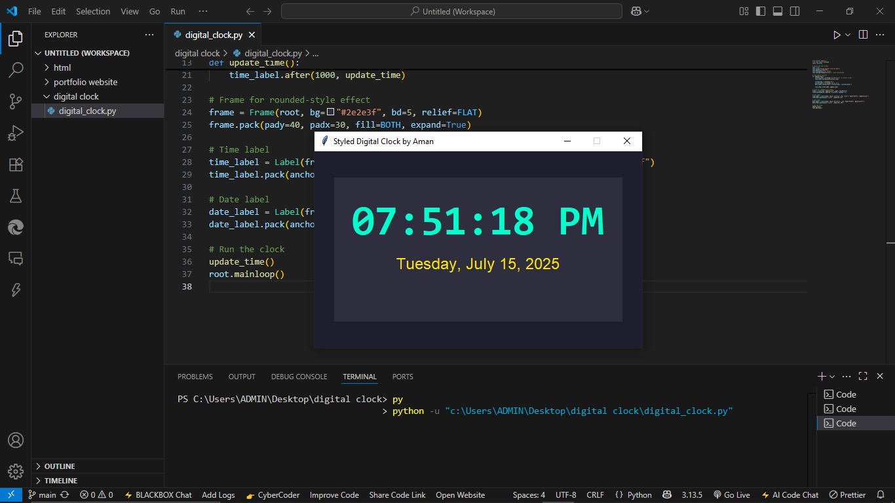

# digital-clock
# 🕒 Digital Clock using Python & Tkinter

A stylish digital clock built with Python and Tkinter, featuring real-time time, day, and date display.  
Created as part of the InternPe internship assignment.

---

## 📸 Screenshot



---

## 📁 Project Structure
digital-clock/

├── digital_clock.py # Main Python script for the clock

├── screenshot.png # UI preview of the clock

└── README.md # Project documentation


---

## 🧰 Technologies Used

| Tool         | Purpose                          |
|--------------|----------------------------------|
| Python 3.13.5| Core programming language         |
| Tkinter      | GUI development (built-in)        |
| time         | Time display and formatting       |
| datetime     | Day and date handling             |

---

## 🚀 How to Run

> You only need Python 3.13.5 installed — no external libraries required.

### Steps:

1. Open the project folder in **VS Code**
2. Locate the file: `digital_clock.py`
3. Right-click and select **“Run Python File”**

   **OR** open terminal and run:

   ```bash
   python digital_clock.py
🙋‍♂️ Author

Aman Kumar

🔗 GitHub: https://github.com/Aman-kumar2006

💼 LinkedIn: https://www.linkedin.com/in/aman-kumar-8b988b28b
