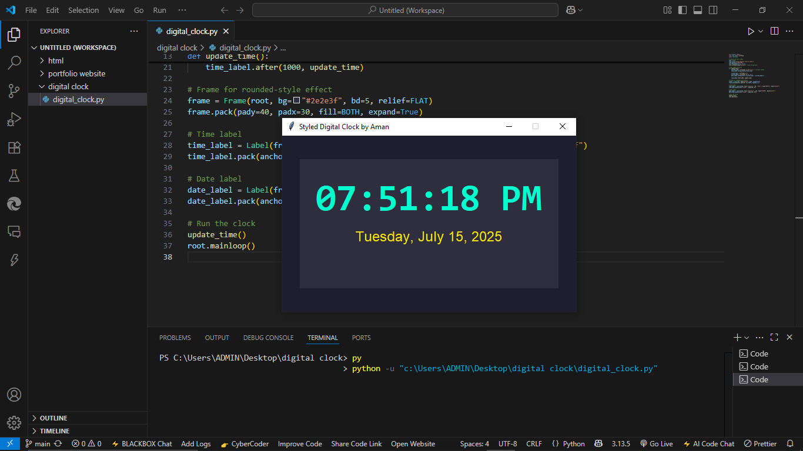

# 🕒 Digital Clock using Python & Tkinter

A visually appealing **Digital Clock GUI Application** built with Python’s `tkinter` library.  
It displays the current time, day, and full date in real-time with a clean, dark-themed interface.

---

## 📸 Screenshot

Here’s what the clock looks like:



---

## ✨ Features

- 🕰️ Live clock in 12-hour format (AM/PM)
- 📅 Shows current day and full date
- 🎨 Stylish dark-themed UI
- 💡 Auto-updates every second using `after()` method
- ✅ Uses only built-in Python modules — no installation needed

---

## 🚀 How to Run This Project

> You only need Python 3 installed (no extra packages).

### 🔧 Steps:

1. Open the folder in **VS Code**
2. Locate the file: `digital_clock.py`
3. Right-click and select **“Run Python File”**  
   OR open terminal and run:

```bash
python digital_clock.py
